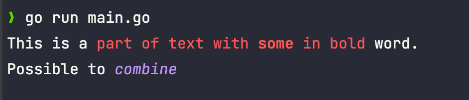
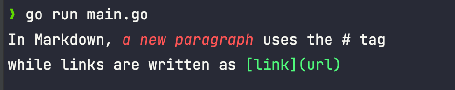

# color
Turns github.com/fatih/color into HTML. Just kidding!

Just a tag based approach to write some nice text.

## Usage

```go
package main

import (
	"fmt"

	render "github.com/hygge-io/color"
)

func main() {

	s := `This is a #red{part of text with #bold{some} in bold} word.
Possible to #(green,italic){combine}`

	renderer := render.New()
	fmt.Println(renderer.Render(s))
}
```



Depending on the text you want to format, it can be necessary to change how the parsing is done:

```go
s := `In Markdown, @(bold)<a new paragraph> uses the # tag
while links are written as @green<[link](url)>`

renderer := render.New().WithTagMarker('@').WithTextLimiter('<', '>')
fmt.Println(renderer.Render(s))
```

