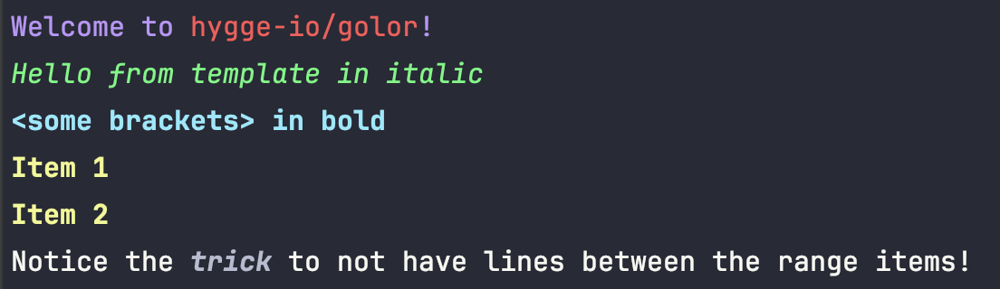

# hygge/golor

 
[](https://goreportcard.com/report/github.com/hygge-io/color)
[](https://pkg.go.dev/github.com/hygge-io/color)

Turns github.com/fatih/color into HTML. Just kidding!

It is just a very convenient way of dealing with colors in the terminal to get some fancy output.

Just a tag based approach to write some nice text, supporting `text/template`.

## Usage

### From simple

```golang
golor.Println(`This is a #red[part of text with #bold[some] in bold] word.
Possible to #(blue,italic)[combine]`)
```


### To more interesting

```golang
	golor.Println(`#(blue)[Welcome to #(red)[hygge-io/golor]!]
#(green,italic)[{{.FromTemplate}} in italic]
#(cyan,bold)[<some brackets> in bold]
{{- range .Items}}
#(yellow,bold)[{{.}}]{{end}}
Notice the #(white,bold,italic)[trick] to not have lines between the range items!`, map[string]any{
		"FromTemplate": "Hello from template",
		"Items":        []string{"Item 1", "Item 2"},
	})
}
```



## Changing the syntax for the style tags!

Depending on the text you want to format, it can be necessary to change how the parsing is done:

```go
s := `In Markdown, @(bold)<a new paragraph> uses the # tag
while links are written as @green<[link](url)>`

renderer := golor.New().WithTagMarker('@').WithTextLimiter('<', '>')
fmt.Println(renderer.Render(s))
```


